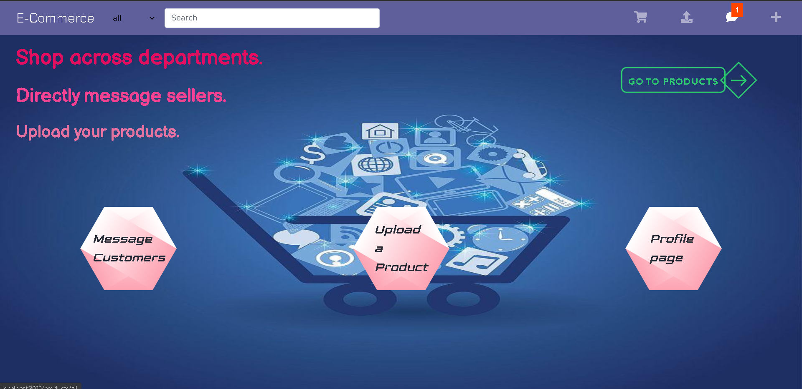
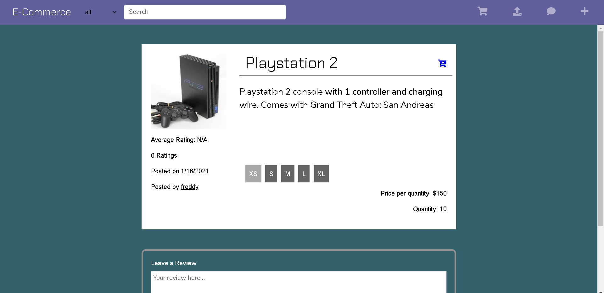
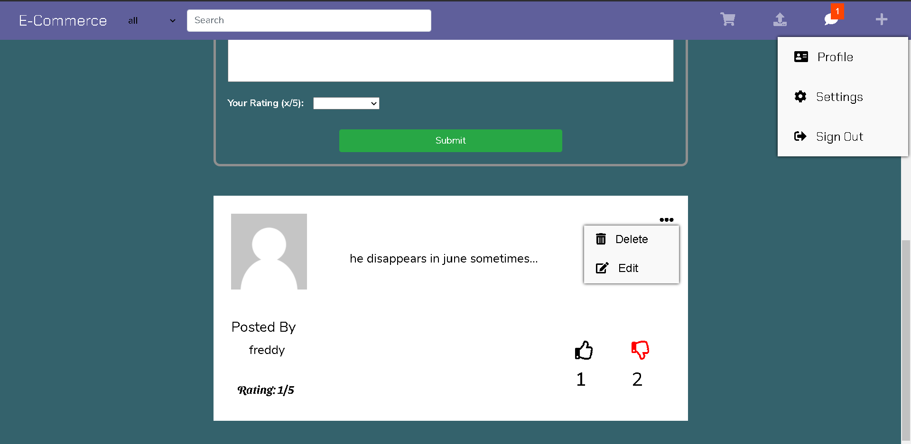
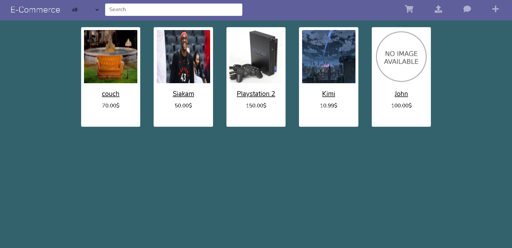
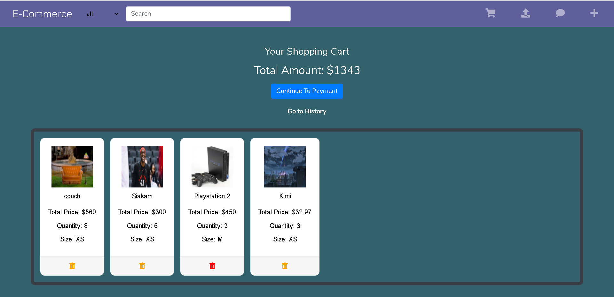
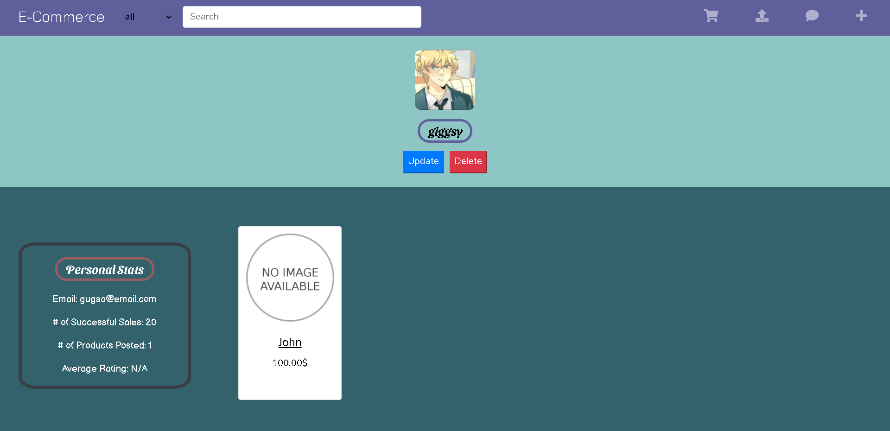
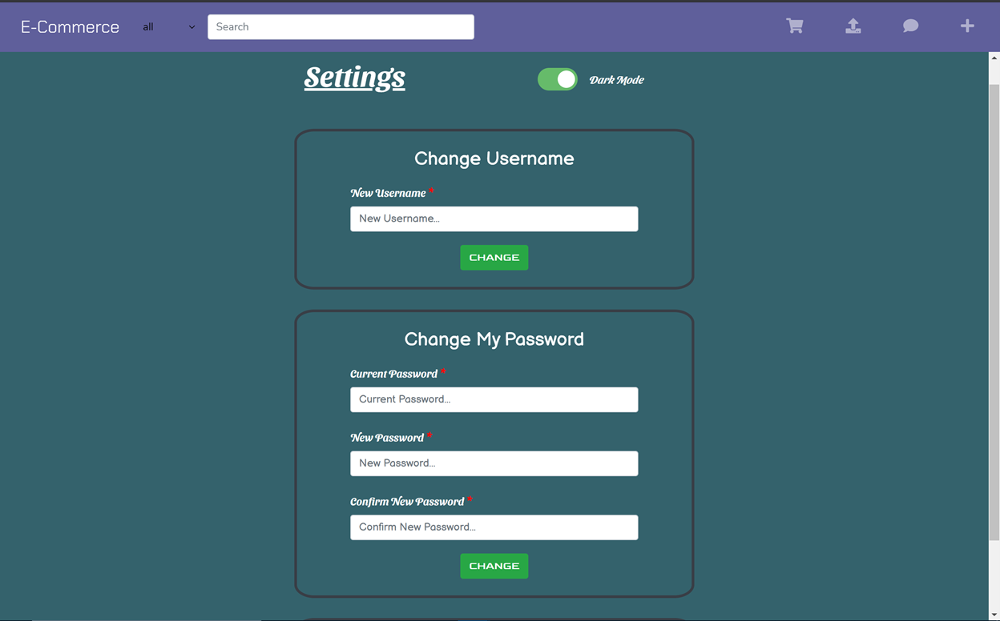
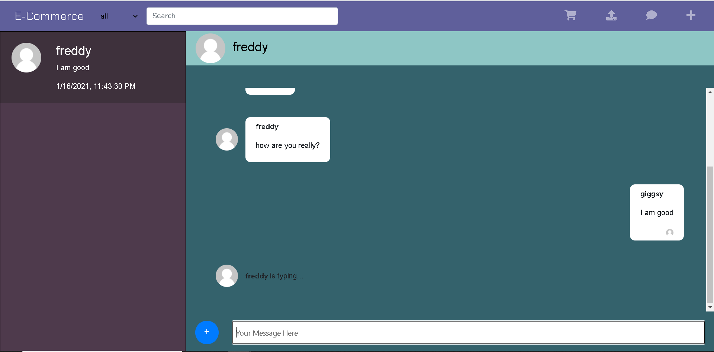
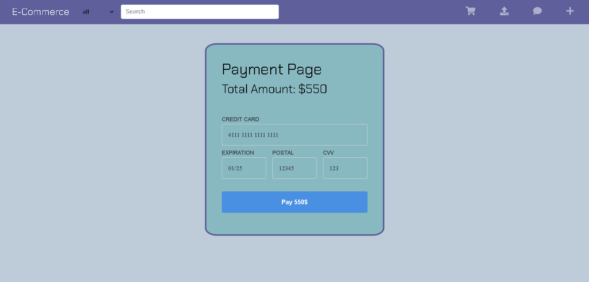

<h1>E-Commerce</h1>

Full stack web application where people post products, buy products, 
and connect with customers using the website's own built-in messaging platform. 
Users can review products and post their thoughts about the said product.
Users can also directly message sellers to negotiate prices and quantities, which is convenient for bulk orders. 

<h3>Tech Stack</h3>
The frontend uses React.js and Bootstrap to create a responsive user interface. 
As for the backend, we used Node.js, Express.js, MongoDB, Socket.io, and Redis. 
Payment is processed in the server through Square's payment API.

<h3>Screenshots </h3>

    
Home Page 

    

    
Products 

    
    
    

    
Profile/Cart 

    
    
    

    
Payment/Other Features 

    
    

