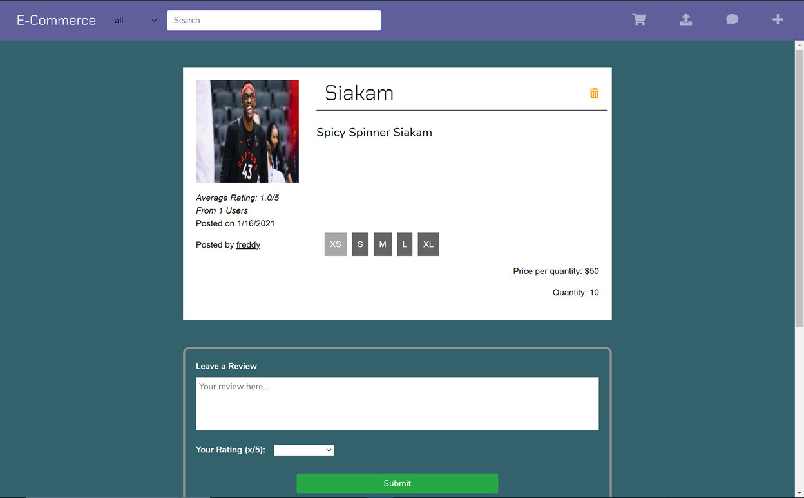

<h1>E-Commerce</h1>

E-Commerce is a platform for people to post products, buy products, and to plug into our social network. Users can review products and post their thoughts about said product. Users can also directly message sellers to negotiate prices and quantities, which is convenient for bulk orders. 

<h3>Tech Stack</h3>
The frontend uses React,js, Redux, and Bootstrap to stylize. As for the backend, we used Express.js, Node.js, MongoDB, Socket.io, and Redis. Payment processing is implemented through Square's payment API.

<h3>Screenshots </h3>

    
Home Page 

    

    
Product Details 

    

    
Settings 

    

    
Profile 

    
    

<h3>Architecture </h3>
The server is modelled using a Model - Controller - Route architecture, and makes use of REST API. The Models are schemas that allows us to access and update attributes
that belong to them. The Controller uses Models to execute certain operations as specified by the client. The Route basically allows us to organize each http request
accordingly. 

